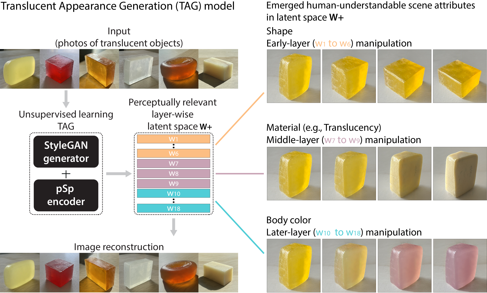

<!-- Improved compatibility of back to top link: See: https://github.com/othneildrew/Best-README-Template/pull/73 -->
<a name="readme-top"></a>
<!--
*** Thanks for checking out the Best-README-Template. If you have a suggestion
*** that would make this better, please fork the repo and create a pull request
*** or simply open an issue with the tag "enhancement".
*** Don't forget to give the project a star!
*** Thanks again! Now go create something AMAZING! :D
-->


<!-- PROJECT SHIELDS -->
<!--
*** I'm using markdown "reference style" links for readability.
*** Reference links are enclosed in brackets [ ] instead of parentheses ( ).
*** See the bottom of this document for the declaration of the reference variables
*** for contributors-url, forks-url, etc. This is an optional, concise syntax you may use.
*** https://www.markdownguide.org/basic-syntax/#reference-style-links
-->


<!-- PROJECT LOGO -->
<br />

<h3 align="center">Translucency perception emerges in deep generative representations for natural image synthesis</h3>

</div>


<!-- TABLE OF CONTENTS -->
<details>
  <summary>Table of Contents</summary>
  <ol>
    <li>
      <a href="#about-the-project">About The Project</a>
    </li>
    <li>
      <a href="#getting-started">Getting Started</a>
      <ul>
        <li><a href="#prerequisites">Prerequisites</a></li>
        <li><a href="#installation">Installation</a></li>
      </ul>
    </li>
   <!--  <li><a href="#usage">Usage</a></li>
    <li><a href="#roadmap">Roadmap</a></li>
    <li><a href="#contributing">Contributing</a></li>
    <li><a href="#license">License</a></li>
    <li><a href="#contact">Contact</a></li>
    <li><a href="#acknowledgments">Acknowledgments</a></li> -->
  </ol>
</details>


<!-- ABOUT THE PROJECT -->
## About The Project



Material perception is essential in planning interactions with the environment. The visual system relies on diagnostic image features to achieve material perception efficiently. However, discovering the features, especially for translucent materials, has been challenging due to the high variability of material appearances under interactions of shape, lighting, and intrinsic materials. Here, we learn a latent space (W+) informative of human translucency perception by developing a deep generative network trained to synthesize images of perceptually persuasive material appearances. Without supervision, human-interpretable scene attributes, including object's shape, material, and body color, spontaneously emerge in the latent space in a scale-specific manner. Critically, the middle-layers of the latent space selectively encode the translucency features correlating with perception, suggesting that translucent impressions are established in the mid-to-low spatial scale features. Our findings illustrate the promising capability of unsupervised learning in finding representative dimensions for materials and discovering perceptually relevant features for visual inference.


<p align="right">(<a href="#readme-top">back to top</a>)</p>


<!-- GETTING STARTED -->
## Psychophysical experiment data

* Experiment 1: Real-vs-generated discrimination [a relative link](/psychophysics-analysis/data/real-fake-judgment-good-data)
* Experiment 2: Material attribute rating
* Experiment 3: Perceptual evaluation of emerged scene attributes

### Prerequisites

This is an example of how to list things you need to use the software and how to install them.
* npm
  ```sh
  npm install npm@latest -g
  ```

### Installation

1. Get a free API Key at [https://example.com](https://example.com)
2. Clone the repo
   ```sh
   git clone https://github.com/github_username/repo_name.git
   ```
3. Install NPM packages
   ```sh
   npm install
   ```
4. Enter your API in `config.js`
   ```js
   const API_KEY = 'ENTER YOUR API';
   ```

<p align="right">(<a href="#readme-top">back to top</a>)</p>

